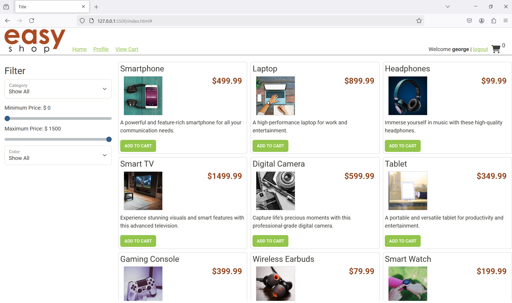
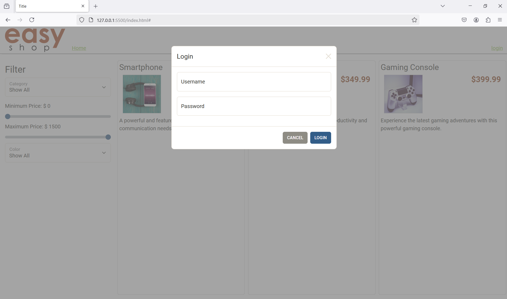
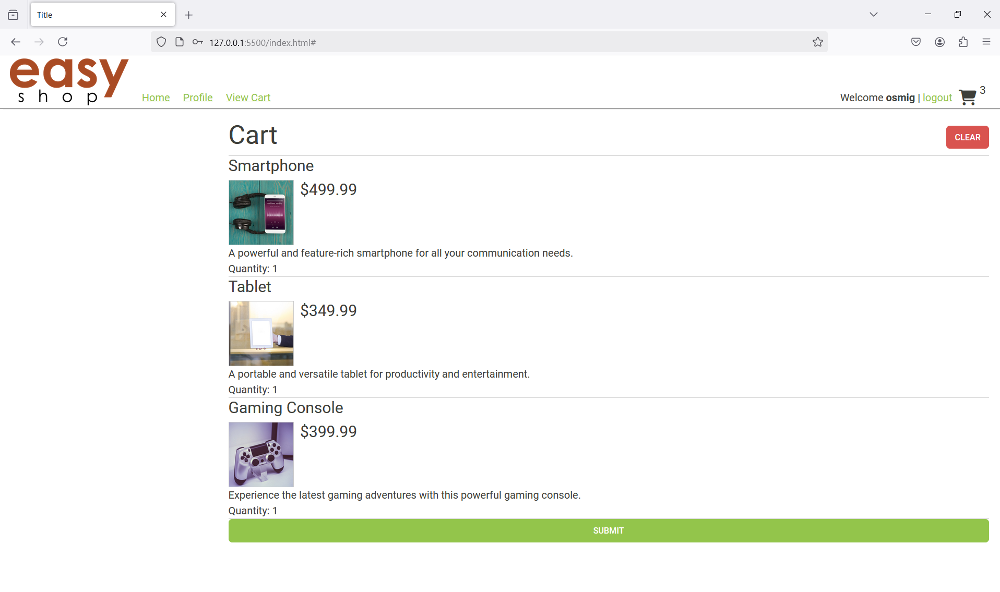
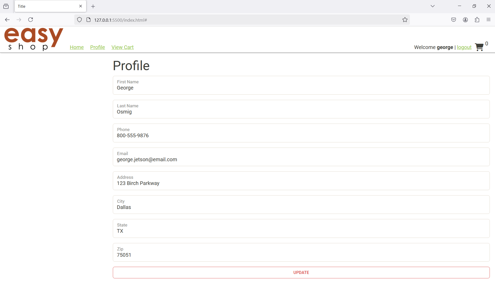
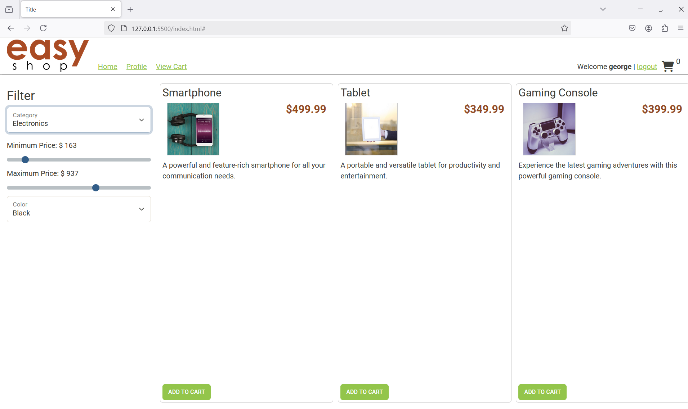

###

This is an e-commerce application, or online store, for a company name EasyShop.
When it comes to the front-end it was already operetional and had been publich as Version 1.
This is the current development on Version 2.

This website uses a Spring Boot API for the backend server, with a MySql databaase for data storage.
Version 2 was heavily relied on Postman to test the applications endpoints and the logic. 

###

## Table Of Content
- [Reference Images](#images)
- [Home Screen](#home-screen)
    - [Filter by price or category](#filter-by-price-or-category)
    - [Login](#login)
    - [Cart](#cart)
    - [Profile](#profile)
    - [Logout](#log-out)
- [Phases](#phases)
    - [Phase 1](#phase-1)
    - [Phase 2](#phase-2)
    - [Phase 3](#phase-3)
    - [Phase 4](#phase-4)
    - [Phase 5](#phase-5)
- [Features](#features)
    - [Thank You](#thank-you)
    - [Submit](#submit)
- [Interesting Code & favorite code](#interesting-code)
    - [MapRow](#maprow)
    - [Generating html](#generating-html)

###
###

## Installation
You can pull this repository locally to access the program. Make sure to use a Java IDE to run the program:
1. `git clone https://github.com/oscar-osmig/DELIcious.git`

Suggested software:
- [Java JDK](https://www.oracle.com/th/java/technologies/downloads)
- [JetBrains IntelliJ](https://www.jetbrains.com/idea/download/)
- [vscode](https://code.visualstudio.com/)
###

# Home Screen
The Home screen of the ecommerce looks like the following:



The Home screen of this ecommerce website was provided. At the start you can look at the products available, 
and can use the filter fearures as well [Filter by price or category](#filter-by-price-or-category).
However, in order to add the products to the cart or submit order [Submit](#submit) you have to be 
logged in already [Login](#login). login with username, and password.

The user must enter the correct username and password. *This is case-sensitive.*

### Filter by price or category
As you can see in [Home Screen](#home-screen) you do not need to be logged in in order to use this feature.
 You can filter by category, price range, and color.

### Login
Being logged in will allow you to add products to shopping cart and see your profile.
Please see [Profile](#profile), [Cart](#cart), as reference on how this feature looks like.

### Cart
The cart is able to allow you to submit your order, as well as give you a thank you message after your
order has succesfully processed.


### Profile
After you've logged in you have the choice of logging out, just click on the logout 
button on the top right corner or be able to see your profile details. See image below for reference of the
log out and profile button.

###

### Logout
You can log out by clicking the loggout button please reference [Profile](#profile)

###

# Phases
This project was done in multiple phases to ensure the best outcome. 
Each phase targeted a specific functionality of the project. 
###

### Phase 1
This phase consisted in making sure the back end was able to load the categories
as soon the website was visited. 
```commandline
VERB URL BODY
GET http://localhost:8080/categories NO body
GET http://localhost:8080/categories/1 NO body
POST http://localhost:8080/categories Category
PUT http://localhost:8080/categorids/1 Category
DELETE http://localhost:8080/categorids/1 NO body

```
###

### Phase 2
This Phase was solely to fix bug such as the filtering of the product not working, 
and the duplication of a product when updating one.
```commandline
Bug 1:
Users have reported the product search is returning incorrect results.
Bug 2: Some users have noticed some of the products are duplicated.

VERB URL
GET http://localhost:8080/products
Key Type Filter
cat int categoryId
minPrice BigDecimal price (lower range)
maxPrice BigDecimal price (upper range)
color String color
Examples
http://localhost:8080/products?cat=1
http://localhost:8080/products?cat=1&color=red
http://localhost:8080/products?minPrice=25
http://localhost:8080/products?minPrice=25&maxPrice=100V
```

### Phase 3

```commandline
New feature
Users should be able to add items to their shopping cart.

VERB URL BODY
GET http://localhost:8080/cart NO body
POST http://localhost:8080/cart/products/15 NO body
PUT http://localhost:8080/cart/products/15 has body
DELETE http://localhost:8080/cart
```
### Phase 4

``` commandline
 When a iser registers for an account, a user record is also created.
 A user should be able to view and update their pofile.
 
 VERB URL BODY
GET http://localhost:8080/profile NO body
PUT http://localhost:8080/profile Profile body

```

### Phase 5
This option as what time of chips customer wants to add.
```commandline
   New feauture
   
   When users are ready to check out the shopping cart should conver into an order.
   
   VERB URL BODY
   POST http://localhost:8080/orders NO body

```

###

# Features
After completing the basic needed features, I added some that I think are useful.

### Thank You

### Submit
The submit button was not provided, however I added it as a feature. 
After it's clicked it displays a thank you message. Please look at [Thank You](#thank-you)
for reference.
###

# Interesting Code

### mapRow
```java
     private Category mapRow(ResultSet row) throws SQLException
    {
      int categoryId = row.getInt("category_id");
      String name = row.getString("name");
      String description = row.getString("description");
  
      return new Category()
      {{
          setCategoryId(categoryId);
          setName(name);
          setDescription(description);
      }};
          
    }
```

Note: I had never seen this sintax, especially the *{{ }}*, this method retrieves the data 
of the category data from the database and creates it a category to return.


### Generating Html
```Java
  JavaScript 
        
    displayThankYouMessage()
    {
        const main = document.getElementById("content");
        const thankYouDiv = document.createElement("div");
        thankYouDiv.classList.add("thank-you-message");
        const asciiArt = document.createElement("pre");
        asciiArt.classList.add("ascii-art");
        asciiArt.innerText = `
        $$$$$$$$$$$$$$$$$$$$$$$$$$$$$$$$$$$$$$$$$$$$$$$$$$$$$$$$$
        $                                                       $
        $   T H A N K   Y O U   F O R   Y O U R   O R D E R !   $
        $                                                       $
        $$$$$$$$$$$$$$$$$$$$$$$$$$$$$$$$$$$$$$$$$$$$$$$$$$$$$$$$$`;
        
        thankYouDiv.appendChild(asciiArt);
        const orderDetailsText = document.createElement("p");
        orderDetailsText.innerText = "Your order has been successfully placed. We will process it shortly.";
        thankYouDiv.appendChild(orderDetailsText);
        
        main.appendChild(thankYouDiv);
    }
```

```java
    CSS

        .thank-you-message 
        {
        font-size: 24px;
        font-weight: bold;
        text-align: center;
        color: #2c3e50;
        background-color: #f7f7f7;
        padding: 20px;
        border-radius: 8px;
        margin-top: 40px;
        box-shadow: 0 4px 6px rgba(0, 0, 0, 0.1);
        max-width: 600px;
        margin-left: auto;
        margin-right: auto;
        }

        .thank-you-message h1 
        {
        font-size: 32px;
        margin-bottom: 10px;
        color: #27ae60; 
        }

        .thank-you-message p 
        {
        font-size: 16px;
        color: #7f8c8d; 
        }

        .ascii-art
        {
        font-family: monospace;
        font-size: 16px;
        color: #2980b9;
        margin-top: 20px;
        white-space: pre;
         text-align: center;
        }
```
Note: for this feature I used the code provided to me in JavaScrip.


###

# Images




###
[Back To Top](#table-of-content)
